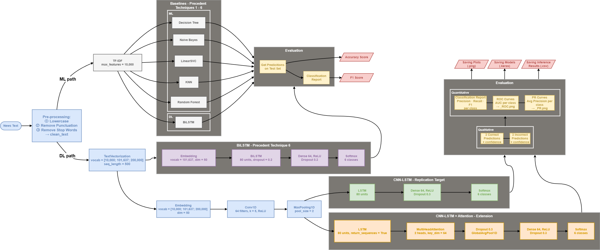

# 📔 ARI5121 - NLP Text Processing Replication Study

**Student:** David Farrugia <br>
**Paper:** [NLP based text classification using TF-IDF enabled fine-tuned long short-term memory: An empirical analysis](https://doi.org/10.1016/j.array.2025.100467)  
**Dataset:** [Kaggle Fake and Real News Dataset](https://www.kaggle.com/datasets/clmentbisaillon/fake-and-real-news-dataset)  
**Task:** Multi-class news source classification (6 categories)

## 🗒️ Task Description

This project is a replication study of the paper:

> _“**NLP based text classification using TF-IDF enabled fine-tuned long short-term memory: An empirical analysis.** - Pratiyush Guleria, Jaroslav Frnda & Parvathaneni Naga Srinivasu”_

The objective is to reproduce the Fine-Tuned CNN-LSTM model proposed in the paper and evaluate its performance on a real-world dataset. The task addressed is multi-class text classification, where news articles are assigned to one of six categories based on their content.

The project implementation follows a complete NLP pipeline, including preprocessing, feature extraction, model training, evaluation, and inference. In addition to replicating the original model, classical machine learning baselines and a modified Fine-Tuned CNN-LSTM with attention are implemented to provide a deeper comparative analysis.

## 🔄 Pipeline Overview

<p align="center">
  
  <em>Figure 1: Overview of the implemented pipeline used in this project.</em>
</p>

## 📊 Reproducing Results

To reproduce the main experiment:

1. Install all required dependencies or clone the repository
2. Run the notebook from start to finish

The main experiment reproduces the CNN-LSTM model across three vocabulary sizes:

- 10,000
- 101,637
- 200,000

Training is performed using:

- 70/30 train–test split
- 20% validation split within training
- Adam optimiser with gradient clipping
- Early stopping and learning rate scheduling

All outputs, including trained models, trainin plots, evaluation plots & elapsed time, are automatically saved.

### 🔍 `load_models.ipynb` Notebook (Optional)

A separate notebook `load_models.ipynb` is included to independently verify the performance of the trained models.

This notebook loads the saved `.keras` models and recomputes key evaluation metrics such as:

- Accuracy
- Weighted F1-score

The purpose is to ensure consistency between saved models and the results reported during training in `ReplicationStudy_Training&Eval.ipynb`.

> [!NOTE]
> This step is completely optional and intended as a validation check rather than part of the main experimental pipeline.

## 💻 Installation

> [!NOTE]
> It is recommended to run this project on Linux, MacOS, or Windows Subsystem for Linux (WSL) in order to make use of the GPU with TensorFlow.

### 1. Create a Virtual Environment (Recommended)

```bash
# Python 3.12.3 was used for this project
$ python3 -m venv .venv             # create .venv
$ source .venv/bin/activate         # activate venv
$ pip install --upgrade pip         # ensure pip is installed and updated
```

### 2. Install Dependencies

```bash
$ pip install pandas nltk tensorflow[and-cuda] scikit-learn plotly kaleido ipykernel nbformat

# OR

$ pip install -r requirements.txt
```

### 3. Running Training and Inference

After installing the dependencies in the virtual environment, **open** or **reload** the notebook in a code IDE or Jupyter Notebook environment and selecting the `Run All` option to execute all cells sequentially.

## ⌛ Expected Runtime

The total runtime depends on hardware, particularly GPU availability. The entire pipline take approximatly `3 - 6 hours` to run `with a 3060TI Nvidia GPU`. Running this notebook without a GPU, will signifcantly increase training times. This is because this notebook is teaining **6 baseline models** _(5 Machine Learning Models and 1 Deep Learning Model)_ along with **6 CNN-LSTM Hybrid models**.

## 📂 Expected Output

The project generates several outputs organised into structured directories:

```bash
Out/
├── Models_.../
│   ├── *.keras                     # Saved Models
│   ├── Training_Plots/
│   ├── Eval_Plots/
│   ├── all_inference_samples.csv   # Inference Results
│   └── time.txt
```

### Outputs include:

- **Trained Models:** Saved in .keras format for reuse
- **Training Plots:** Loss and accuracy curves across epochs
- **Evaluation Plots:** ROC-AUC and Precision–Recall curves for each class
- **Inference Results:** CSV file containing:
  - Correct and incorrect predictions
  - Confidence scores
  - Raw and cleaned text samples
- **Logged Time:** Text fime containing how much time has passed for start to finish, in minuites and hours.

These outputs support both quantitative evaluation and qualitative error analysis.

## 📝 Notes on Reproduction

The original paper does not provide a complete implementation of the CNN-LSTM architecture. Therefore, the model used in this project was reconstructed based on the methodology description and architecture diagram presented in the paper.

Where implementation details were unclear, reasonable assumptions and external tools were used to assist in interpreting and analysing the methodology. However, all final implementation decisions were made within the context of this study.

## 👍 Acknowledgments

This individual project was carried out as part of the partial fulfilment of the requirements for the **ARI5121 Applied Natural Language Processing** course @ **[The University of Malta](https://www.um.edu.mt/)**.

## 📧 Contact

For any inquiries or feedback, please contact [David Farrugia](mailto:david.farrugia.22@um.edu.mt)
